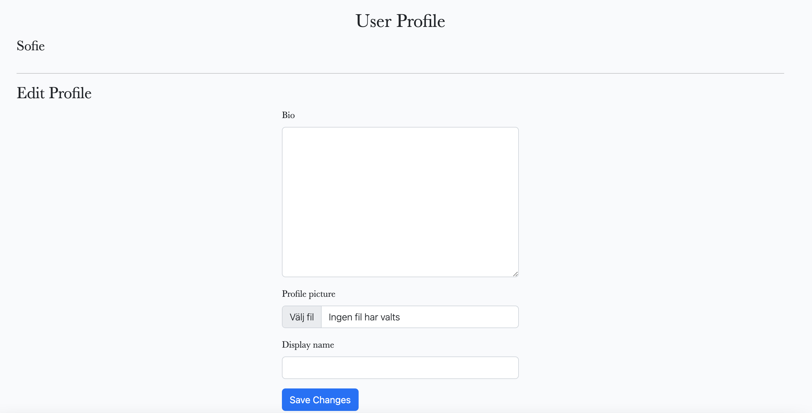
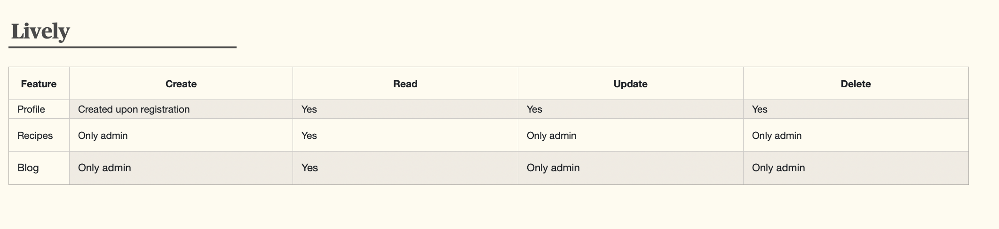

## Lively

## Introduction
Lively is a healthy lifestyle blog, helping you creating a healthier everyday life. Lively posts daily about exercise, meditation and healthy food. At Lively you can find breakfast, lunch, snacks and dinner recipes, and logged in users can like and comment on posts. Overall tips for helping you become a happier and more balanced version of yourself. 
Lively has been developed as part of the Code Institute's Full-Stack Developer course as my 4th project - focusing on Django and Bootstrap frameworks, Database manipulation and CRUD functionality. It is for educational purposes only.

[]

View live site here :  [Lively](https://lively-blog-3c360fbcc1c8.herokuapp.com/)

For Admin access with relevant sign-in information:  [Lively Admin](https://lively-blog-3c360fbcc1c8.herokuapp.com/admin/login/?next=/admin/)

## [Table of contents](https://github.com/idamariasofie/lively#table-of-contents)

- [Lively](https://github.com/idamariasofie/lively#lively)
    - [Introduction](https://github.com/idamariasofie/lively#introduction)
    - [Table of Contents](https://github.com/idamariasofie/lively#table-of-contents)
    - [Overview](https://github.com/idamariasofie/lively#overview)
- [UX - User Experience](https://github.com/idamariasofie/lively#ux---user-experience)
    - [Design Inspiration](https://github.com/idamariasofie/lively#design-inspiration)
        - [Color Scheme](https://github.com/idamariasofie/lively#color-scheme)
        - [Font](https://github.com/idamariasofie/lively#font)
- [Project Planning](https://github.com/idamariasofie/lively#project-planning)
    - [Strategy Plane](https://github.com/idamariasofie/lively#strategy-plane)
        - [Site Goals](https://github.com/idamariasofie/lively#site-goals)
    - [Agile Methodologies - Project Management](https://github.com/idamariasofie/lively#agile-methodologies---project-management)
        - [MoSCoW Prioritization](https://github.com/idamariasofie/lively#moscow-prioritization)
        - [Sprints](https://github.com/idamariasofie/lively#sprints)
    - [User Stories](https://github.com/idamariasofie/lively#user-stories)
        - [Visitor User Stories](https://github.com/idamariasofie/lively#visitor-user-stories)
        - [Epic - User Profile](https://github.com/idamariasofie/lively#epic---user-profile)
        - [Epic - Articles](https://github.com/idamariasofie/lively#epic---articles)
        - [Epic - Booking](https://github.com/idamariasofie/lively#epic---booking)
        - [Epic - Photo Gallery](https://github.com/idamariasofie/lively#epic---photo-gallery)
    - [Scope Plane](https://github.com/idamariasofie/lively#scope-plane)
    - [Structural Plane](https://github.com/idamariasofie/lively#structural-plane)
    - [Skeleton & Surface Planes](https://github.com/idamariasofie/lively#skeleton--surface-planes)
        - [Wireframes](https://github.com/idamariasofie/lively#wireframes)
        - [Database Schema - Entity Relationship Diagram](https://github.com/idamariasofie/lively#database-schema---entity-relationship-diagram)
        - [Security](https://github.com/idamariasofie/lively#security)
- [Features](https://github.com/idamariasofie/lively#features)
    - [User View - Registered/Unregistered](https://github.com/idamariasofie/lively#user-view---registeredunregistered)
    - [CRUD Functionality](https://github.com/idamariasofie/lively#crud-functionality)
    - [Features](https://github.com/idamariasofie/lively#feature-showcase)
    - [Future Features](https://github.com/idamariasofie/lively#future-features)
- [Technologies & Languages Used](https://github.com/idamariasofie/lively#technologies--languages-used)
    - [Libraries & Frameworks](https://github.com/idamariasofie/lively#libraries--frameworks)
    - [Tools & Programs](https://github.com/idamariasofie/lively#tools--programs)
- [Testing](https://github.com/idamariasofie/lively#testing)
- [Deployment](https://github.com/idamariasofie/lively#deployment)
    - [Connecting to GitHub](https://github.com/idamariasofie/lively#connecting-to-github)
    - [Django Project Setup](https://github.com/idamariasofie/lively#django-project-setup)
    - [Cloudinary API](https://github.com/idamariasofie/lively#cloudinary-api)
    - [Elephant SQL](https://github.com/idamariasofie/lively#elephant-sql)
    - [Heroku deployment](https://github.com/idamariasofie/lively#heroku-deployment)
    - [Clone project](https://github.com/idamariasofie/lively#clone-project)
    - [Fork Project](https://github.com/idamariasofie/lively#fork-project)
- [Credits](https://github.com/idamariasofie/lively#credits)
    - [Code](https://github.com/idamariasofie/lively#code)
    - [Media](https://github.com/idamariasofie/lively#media)
        - [Additional reading/tutorials/books/blogs](https://github.com/idamariasofie/lively#additional-readingtutorialsbooksblogs)
    - [Acknowledgements](https://github.com/idamariasofie/lively#acknowledgements)

## [Overview](https://github.com/idamariasofie/lively#overview)

# [Lively](https://github.com/idamariasofie/lively)

Lively is a healthy lifestyle blog that invites users to:

- Get inspired by daily blog posts to add healthy habits to their lives.
- Browse and filter recipes for breakfast, lunch, snacks, dinner, etc.
- Create their own profiles.
- Like and interact with blog posts.

Lively is accessible via all browsers with full responsiveness on different screen sizes. Its aim is to create a safe, informed community of users looking to improve their lives with exercise, meditation, and nutritious food. This site has been created to meet the needs of adding healthy habits to your everyday life in an easy way. Visit the blog and get inspired by the daily posts, or explore the recipe page to filter and browse through all the recipes.

In future development, the project aims to offer users an upgraded premium system with payment options for weekly meal planning sent customized based on their profiles and preferences. Users will also be able to save and add recipes, training guides, etc., to their profile for easy access to their favorites.

# [UX - User Experience](https://github.com/idamariasofie/lively#ux---user-experience)

## [Design Inspiration](https://github.com/idamariasofie/lively#design-inspiration)

I wanted Lively to have a warm yet clean aesthetic feeling with colorful food photography, clean magazine-like typography, and design. This approach allows photos to stand out with their beautiful colors.

### [Color Scheme](https://github.com/idamariasofie/lively#color-scheme)

Due to the large hero sections with colorful photography, the overall design is clean yet elegant. Here is the color scheme:

[]

### [Fonts](https://github.com/idamariasofie/lively#fonts)

Using [Google Fonts](https://fonts.google.com/), I imported 'Baskerville' and 'Lora'. Baskerville, a classic serif font, gives the website a clean look, resembling printed magazines, while Lora has a modern vibe that works well for longer texts.

### [Imagery](https://github.com/idamariasofie/lively#imagery)

All the imagery has been carefully selected to align with the overall feeling of Lively and the website. The remaining imagery will be uploaded by the author to the database.

# [Project Planning](https://github.com/idamariasofie/lively#project-planning)

The project goal was to build a simple blog to promote a healthier everyday life, with a focus on lifestyle, recipes, exercises, and meditation guides.

## [Site Goals](https://github.com/idamariasofie/lively#site-goals)

- Provide users with a good experience.
- Create a visually pleasing and intuitive website.
- Ensure easy navigation and fulfillment of feature CRUD functionalities.
- Maintain consistent UX across different devices.
- Allow scalability for future additions.

## [Agile Methodologies - Project Management](https://github.com/idamariasofie/lively#agile-methodologies---project-management)

Lively follows Agile planning methods, using the [Github Projects Board](https://github.com/users/idamariasofie/projects/3/views/1?filterQuery=) to plan and document all work.

### [MoSCoW Prioritization](https://github.com/idamariasofie/lively#moscow-prioritization)

- **Must Haves:** Critical components for the project, reaching MVP.
- **Should Haves:** Valuable components not vital at the MVP stage.
- **Could Haves:** Nice-to-have features if time allows.
- **Won't Haves:** Features of low priority or no longer fitting the project's brief.

### [Sprints](https://github.com/idamariasofie/lively#sprints)

Sprints were planned to achieve the MVP a month before the submission date of March 4, 2024.

# [User Stories](https://github.com/idamariasofie/lively#user-stories)

User stories and features are managed on [GitHub Projects](https://github.com/users/idamariasofie/projects/3/views/1?filterQuery=).

## [Lively User Stories](https://github.com/idamariasofie/lively#visitor-user-stories)

Visitor user story

User profile

Recipes

# [Scope Plan](https://github.com/idamariasofie/lively#scope-plane)

To manage project scope effectively, essential features were identified early on, including:

- Accessible, easy-to-navigate website.
- Responsive design for various devices.
- User Authentication and Profile creation/editing.
- Recipe page with filter function.
- Commenting on posts after authentication.
- Business details for user information.

Planning allowed for a balance between feasibility and satisfaction of assessment criteria.

# [Skeleton & Surface Plan](https://github.com/idamariasofie/lively#skeleton--surface-planes)

## [Wireframes](https://github.com/idamariasofie/lively#wireframes)

### Home Page Wireframes

Wireframes for the login/logout, sign up, and contact us pages maintain a similar design for consistency throughout the website.

Sign Up Wireframe

## [Database Schema - Entity Relationship Diagram](https://github.com/idamariasofie/lively#database-schema---entity-relationship-diagram)

Entity Relationship Diagram (ERD) for Lively, displaying relationships between feature components within the database

This ERD demonstrates how each feature interacts with each other and the connected PostgreSQL Database. Using Django's User Model, and Django AllAuth to carry out the user authentication. A user_id is created when the user registers with their username and email. 
This allows the user to access and edit their profile, bio, image etc and add comments, when logged in. For future development, a weekly meal plan could be added and saved recipes, that could be accessed from the profile. 

The Profile, Recipes and Comments Models were inspired by the blog walkthrough by the Code Institute and the [Smoothies App by Soukaina Samadi](https://github.com/soukasamadi/Smoothies-blog?tab=readme-ov-file). 
They helped me to get a good and secure grasp of the templating structure and connected Python files to push my features further, adjusting them to suit my project. 

Through the Admin Django Dashboard, the connected user_id to all data entered to the site means that the Admin can remove a User and their data completely through the additon of on_delete=models.CASCADE. 
A user can delete their profile, but they can not delete the comments they have posted, this feature will come in the next version.

# [Security](https://github.com/idamariasofie/lively#security)

A number of security steps were taken in this project to protect the user's submitted data. To meet the strict internet standards of protecting a user's data, the following processes were included in the project's development.

**AllAuth**

Django AllAuth is an installable framework that takes care of the user registration and authentication process. Authentication was needed to determine when a user was registered or unregistered, and it controlled what content was accessible on Lively. The setup of AllAuth included:

- Installing it in my workspace dependencies.
- Adding it to my INSTALLED_APPS in my settings.py.
- Sourcing the AUTHENTICATION_BACKENDS from the AllAuth docs for my settings.py.
- Adding its URL to my project's 'urls.py'.
- Running database migrations to create the tables needed for AllAuth.

**Defensive Design**

Lively was developed to ensure a good user experience, to the best of my current learning experience with Django.

- Input validation and error messages provide feedback to the user to guide them towards the desired outcome.
- Unregistered users are diverted to the Sign Up page from restricted access pages.
- Authentication processes control edit/delete icons to reveal them to the content author only.
- Deletion of a profile is confirmed through an additional page, double-checking with the user.
- Error pages are displayed with 'Home' buttons to help users get back on track.
- Testing and validation of features complete the process.

**CSRF Tokens**

CSRF (Cross-Site Request Forgery) tokens are included in every form to help authenticate the request with the server when the form is submitted. Absence of these tokens can leave a site vulnerable to attackers who may steal a user's data.

# [Features](https://github.com/idamariasofie/lively#features)

## [User View - Registered/Unregistered](https://github.com/idamariasofie/lively#user-view---registeredunregistered)

The idea behind Lively is to make healthy recipes accessible to all who want to live a healthier life. Therefore, I wanted most parts of the website to be accessible without creating a user.
And then inviting them to the Lively community by providing special features for users; at the moment, this makes it possible to add comments, but for the future, more features could be added.

## [CRUD Functionality](https://github.com/idamariasofie/lively#crud-functionality)

Users can Create, Read, Update, and Delete their shared information on Lively. Some features make full CRUD functionality available, while others present the necessary options only.

## [Features Showcase](https://github.com/idamariasofie/lively#feature-showcase)

**Header/Navigation & Footer**

Features showcase, screenshots of the features in use were taken on a laptop. All code for the navbar and footer has been added in the base.html, which was then extended into other pages.

Header & Navigation - (Profile headline only visible to Logged-In Users)

Footer - Visible to all Users

In the footer, the social-media icons open in a new tab when clicked. Lively does not have any active social media currently, so the Facebook, Instagram, Twitter, and Youtube links only bring the user to the home pages.

## [Home Page](https://github.com/idamariasofie/lively#home-page)

**Home Page**

Home Page - Visible to all Users

In the Home Page 'Hero' section, a carousel is displaying photos and links to about us, and the recipes page. 

## [Recipes Page](https://github.com/idamariasofie/lively#recipes-page)

**Recipes page**

Recipes page - Visible to all Users

On this page, all recipes are being displayed, with a headline above making it easy for users to filter the recipes by category (All, Bread, Breakfasts, Lunch, Salads, Snacks, Sweet treats). 

The user can then open each recipe by clicking on it, and it will open and display an image and the full recipe instructions. The comment section will also be displayed, but only logged-in users are able to add a comment.

## [About Page](https://github.com/idamariasofie/lively#about-page)

**About Page**

About Page - Visible to all Users

The 'About' section contains a short introduction to Liv, the founder of Lively, and a Q&A with her to get to know her better, and the thoughts behind the blog and the website.

## [Blog](https://github.com/idamariasofie/lively#blog)

**Blog**

Blog Page - Visible to all Users

The Blog displays all posts made on Lively. These features post on meditation, exercise and recipes. The Blog is supposed to inspire the users to live a balanced and healthy life, not only providing recipes.

## [Contact](https://github.com/idamariasofie/lively#contact)

**Contact**

Contact page - Visible to all Users 

The contact page features a contact form, making it easy for visitors to send comments or questions to Lively.

## [Login](https://github.com/idamariasofie/lively#login)

**Login**

Login Page - Visible to all Users 

The user is greeted with a welcome message and a link to the sign-up page if they have not created a user profile yet. The user is asked to enter their Username and password when signing in. 

A message appears for the user when logged in "You are logged in as..."

## [Logout](https://github.com/idamariasofie/lively#logout)

**Logout**

Logout Page - Registered Users only

When clicking on the "Logout" headline, the user is asked "Are you sure you want to logout?". 

And can then choose between, "Yes, Logout" - and will be redirected to the Lively Homepage, or "No, Go back"

## [Profile](https://github.com/idamariasofie/lively#profile)

**Profile**

Profile Page - Registered Users only

The user profile is created upon registration, in the profile when clicking on the headline. The user will access "User Profile" displaying their name, bio, profile picture and Display name. 
At the bottom of this page, the user can also access the "Delete profile" button. 

## [Delete Profile](https://github.com/idamariasofie/lively#delete-profile)

**Delete profile**

Delete Profile Page - Registered Users only

Will appear when the user clicked on the "Delete profile" button. The user is being asked if they are sure they want to delete their profile. 

## [Admin Panel](https://github.com/idamariasofie/lively#admin-panel)

**Admin Panel**

Through Django's built-in Administration Panel, the Admin has full access over the data submitted to the website by registered Users. To access the Admin panel, the Admin user adds '/admin/' to the end of the URL to display [Admin](https://8000-idamariasofie-lively-ui5lancuij8.ws-eu108.gitpod.io/admin/). 
A username and password are requested. It is only the website owner that has access to admin, and she is the only superuser. In admin, you can approve comments, add, edit, and delete recipes and blog posts.

# Future Features

[Future Features](https://github.com/idamariasofie/lively#future-features)

- **Downloadable app with quicker access to recipes, meal plans, exercise, and meditation**: I can envision Lively as an app developing it into a healthy lifestyle space and build the community.
- **Introduce weekly meal and workout plans**: This would require a paid membership, where the user will get access to weekly meal plans, workout plans, and meditation suggestions.
- **Merchandise section with Lively products**: An easy way for users to find tools for both cooking and workouts.

# Technologies & Languages Used

[Technologies & Languages Used](https://github.com/idamariasofie/lively#technologies--languages-used)

- HTML
- CSS
- JavaScript
- Python
- [Git](https://git-scm.com/): Used for version control.
- [GitHub](https://www.github.com/): Used for online storage of codebase and Projects tool.
- [Gitpod](https://www.gitpod.io): Used as an online, cloud-based IDE for development.
- [Figma](https://www.figma.com/): Used for project design planning and wireframe creation.
- [Adobe Color](https://color.adobe.com/): Used for color theme creation and accessibility checkers.
- [Django](https://www.djangoproject.com/): Used as the Python framework for the site.
- [Cloudinary](https://cloudinary.com/): Used for cloud media storage of user-uploaded images.
- [ElephantSQL](https://www.elephantsql.com/): Used to host the PostgreSQL database needed to collect and recall the user's data.
- [Heroku](https://www.heroku.com/): Used to host the Lively application.
- [WAVE](https://wave.webaim.org/): Used to evaluate the accessibility of the site.

## Libraries & Frameworks

[Libraries & Frameworks](https://github.com/idamariasofie/lively#libraries--frameworks)

### Django Packages

[Django Packages](https://github.com/idamariasofie/lively#django-packages)

- [Gunicorn](https://gunicorn.org/): Used as the server for Heroku.
- [Cloudinary](https://cloudinary.com/): Used to host the static files and media.
- [Dj_database_url](https://pypi.org/project/dj-database-url/): Used to parse the database URL from the environment variables in Heroku.
- [Psycopg2](https://pypi.org/project/psycopg2/): Used as an adaptor for Python and PostgreSQL databases.
- [Summernote](https://summernote.org/): Used as a text editor.
- [Allauth](https://django-allauth.readthedocs.io/en/latest/installation.html): Used for authentication, registration, and account management.
- [Crispy Forms](https://django-crispy-forms.readthedocs.io/en/latest/): Used to style the forms.

### Frameworks - Libraries - Programs Used

[Frameworks - Libraries - Programs Used](https://github.com/idamariasofie/lively#frameworks---libraries---programs-used)

- [Bootstrap](https://getbootstrap.com/): Used to style the website, add responsiveness, and interactivity.
- [Jquery](https://jquery.com/): All the scripts were written using the jQuery library.
- [Git](https://git-scm.com/): Git was used for version control by utilizing the Gitpod terminal to commit to Git and push to GitHub.
- [GitHub](https://github.com/): GitHub is used to store the project's code after being pushed from Git.
- [Heroku](https://id.heroku.com/): Heroku was used to deploy the live project.
- [PostgreSQL](https://www.postgresql.org/): Database used through Heroku.
- [Lucidchart](https://www.lucidchart.com/pages): Lucidchart was used to create the database diagram.
- [PEP8](http://pep8online.com/): PEP8 was used to validate all the Python code.
- [W3C - HTML](https://validator.w3.org/): W3C- HTML was used to validate all the HTML code.
- [W3C - CSS](https://jigsaw.w3.org/css-validator/): W3C - CSS was used to validate the CSS code.
- [Fontawesome](https://fontawesome.com/): Used to add icons to the website.
- [Google Chrome Dev Tools](https://developer.chrome.com/docs/devtools/): Used to check App responsiveness and debugging.
- [Google Fonts](https://fonts.google.com/): Used to add the 2 fonts that were used throughout the project.
- [Coolors](https://coolors.co/): Used to build the color palette of the project.
- [Am I Responsive](https://ui.dev/amiresponsive/): Used display the website on different screen sizes.

## Tools & Programs

[Tools & Programs](https://github.com/idamariasofie/lively#tools--programs)

- [Cloud Converter](https://cloudconvert.com/): Used for file conversion to PNG, WEBP.
- [Lucidchart](https://www.lucidchart.com/pages): Used for ERD (entity relationship diagram) creation.
- [Perplexity AI](https://www.perplexity.ai/): Used for breaking down Python concepts and Django documentation into more understandable chunks.
- [Favicon](https://favicon.io/): Used for converting an icon into favicon.

# Testing

[Testing](https://github.com/idamariasofie/lively#testing)

For all testing, please refer to the [TESTING.md](https://github.com/idamariasofie/lively/blob/main/TESTING.md) file.

# Deployment

[Deployment](https://github.com/idamariasofie/lively#deployment)

## Connecting to GitHub

[Connecting to GitHub](https://github.com/idamariasofie/lively#connecting-to-github)

To begin this project from scratch, you must first create a new GitHub repository using the [Code Institute's Template](https://github.com/Code-Institute-Org/ci-full-template). This template provides the relevant tools to get you started. To use this template:

1. Log in to GitHub or create a new account.
2. Navigate to the [Code Institute's Template](https://github.com/Code-Institute-Org/ci-full-template).
3. Click 'Use this template' -> 'Create a new repository'.
4. Choose a new repository name and click 'Create repository from template'.
5. In your new repository space, click Gitpod (if this is your IDE of choice) button to generate a new workspace.

## Django Project Setup

[Django Project Setup](https://github.com/idamariasofie/lively#django-project-setup)

1. Go to the Code Institute Gitpod Full Template [Template](https://github.com/Code-Institute-Org/gitpod-full-template).
2. Click on 'Use This Template'.
3. Once the template is available in your repository, click on Gitpod.
4. When the image for the template and the Gitpod are ready, open a new terminal to start a new Django App.
5. Install Django and Gunicorn: `pip3 install django gunicorn`.
6. Install supporting database libraries dj_database_url and psycopg2 library: `pip3 install dj_database_url psycopg2`.
7. Create a file for requirements: in the terminal window, type `pip freeze --local > requirements.txt`.
8. Create a project: in the terminal window, type `django-admin startproject your_project_name`.
9. Create an app: in the terminal window, type `python3 manage.py startapp your_app_name`.
10. Add the app to the list of installed apps in the settings.py file: `your_app_name`.
11. Migrate changes: in the terminal window, type `python3 manage.py migrate`.
12. Run the server to test if the app is installed, in the terminal window, type `python3 manage.py runserver`.
13. If the app has been installed correctly, the window will display "The install worked successfully! Congratulations!".

## Cloudinary API

[Cloudinary API](https://github.com/idamariasofie/lively#cloudinary-api)

- [Cloudinary](https://cloudinary.com/) was used for cloud media storage of user-uploaded images.

## Elephant SQL

[Elephant SQL](https://github.com/idamariasofie/lively#elephant-sql)

- [ElephantSQL](https://www.elephantsql.com/) was used to host the PostgreSQL database needed to collect and recall the users' data.

## Heroku Deployment

[Heroku Deployment](https://github.com/idamariasofie/lively#heroku-deployment)

1. Log in to [Heroku](https://www.heroku.com/) or create a new account.
2. Click on the '**New**' button and then '**Create New App**'.
3. Choose a unique name for your app (it will show if the name is available).
4. Select your region and click '**Create App**'.
5. In the '**Deployment Method**' section, select '**GitHub**' as the deployment method.
6. Connect to your GitHub profile and search for the repository you want to deploy.
7. Once the repository is connected, scroll down to the '**Manual Deploy**' section and click '**Deploy Branch**'.
8. After a successful deployment, click the '**View**' button to open your live app.

## Clone Project

[Clone Project](https://github.com/idamariasofie/lively#clone-project)

To clone this project to your local machine:

1. Click on the '**Code**' button at the top of the repository.
2. Copy the URL from the HTTPS section.
3. Open your terminal.
4. Change the current working directory to the location where you want the cloned directory.
5. Type `git clone`, and then paste the URL you copied earlier.
6. Press Enter to create your local clone.

## Fork Project

[Fork Project](https://github.com/idamariasofie/lively#fork-project)

To fork this repository:

1. Navigate to the [repository](https://github.com/idamariasofie/lively).
2. Click the '**Fork**' button at the top right of the page.
3. After the process is complete, you will have a copy of the repository in your GitHub account.

# Credits

[Credits](https://github.com/idamariasofie/lively#credits)

## Code

[Code](https://github.com/idamariasofie/lively#code)

- The design of the login and registration system was heavily influenced by Code Institute's Boutique Ado project.

## Media

[Media](https://github.com/idamariasofie/lively#media)

- The images used in this site were obtained from Unsplash and Pexels.
- The favicon was generated using [Favicon](https://favicon.io/).

### Additional reading/tutorials/books/blogs

[Additional Reading/Tutorials/Books/Blogs](https://github.com/idamariasofie/lively#additional-readingtutorialsbooksblogs)

- [MDN Web Docs](https://developer.mozilla.org/)
- [W3Schools](https://www.w3schools.com/)
- [Stack Overflow](https://stackoverflow.com/)
- [CSS-Tricks](https://css-tricks.com/)
- [Real Python](https://realpython.com/)
- [Django Documentation](https://docs.djangoproject.com/)

# Credits

[Jump to Credits in Table of Contents](https://github.com/idamariasofie/lively#credits)

## Code

The sources complemented my learning for this project, alongside the [Code Institute's](https://codeinstitute.net/ie/) Learning Content.

- [Django Docs](https://github.com/idamariasofie/lively#django-docs)
- [Bootstrap Docs](https://github.com/idamariasofie/lively#bootstrap-docs)
- [Google Fonts](https://github.com/idamariasofie/lively#google-fonts)
- [Font Awesome](https://github.com/idamariasofie/lively#font-awesome)

### [Add Hero Image](https://github.com/idamariasofie/lively#add-hero-image):

- [Google Search](https://www.google.com/search?q=add+bootstrap+hero+image&rlz=1C5CHFA_enSE956SE956&oq=add+bootstrap+hero+image&gs_lcrp=EgZjaHJvbWUyBggAEEUYOTIHCAEQIRigATIHCAIQIRigAdIBCDY2MDRqMGo3qAIAsAIA&sourceid=chrome&ie=UTF-8#fpstate=ive&vld=cid:25156212,vid:pEwA4-Mmnj8,st:0)

### [Design Inspiration and Recipes](https://github.com/idamariasofie/lively#design-inspiration-and-recipes):

- [Green Kitchen Stories](https://greenkitchenstories.com/)

### [Bootstrap Responsive Images (Carousel)](https://github.com/idamariasofie/lively#bootstrap-responsive-images-carousel):

- [Bootstrap Docs](https://getbootstrap.com/docs/5.3/content/images/)

### [Add Bootstrap 5 Element](https://github.com/idamariasofie/lively#add-bootstrap-5-element):

- [Medium Article](https://medium.com/@devsumitg/how-to-add-bootstrap-5-to-django-framework-47817c9d1adf)

### [Create Django Contact Form](https://github.com/idamariasofie/lively#create-django-contact-form):

- [Mailtrap Article](https://mailtrap.io/blog/django-contact-form/)

### [Style Login Page](https://github.com/idamariasofie/lively#style-login-page):

- [YouTube Tutorial](https://www.youtube.com/watch?v=6-XXvUENY_8)

### [Install Bootstrap](https://github.com/idamariasofie/lively#install-bootstrap):

- [Coding Gear](https://codinggear.org/add-bootstrap-to-django/)

### [ChatGPT](https://github.com/idamariasofie/lively#chatgpt):

- For explaining URLs
- Implementing Comment model and CommentForm

## Media

[Jump to Media in Table of Contents](https://github.com/idamariasofie/lively#media)

The following sites were used to gather the photographic media used in Lively:

- [Unsplash](https://unsplash.com/)

Inspiration for the website and all food recipes were taken from:

- [Green Kitchen Stories](https://greenkitchenstories.com)

## Acknowledgements

[Jump to Acknowledgements in Table of Contents](https://github.com/idamariasofie/lively#acknowledgements)

- Special thank you to my husband for making it possible for me to finalize this project, steering through all colds in February in Sweden and taking care of our boys.

- Thank you to my mentor Luke Buchanan for his positive support, guidance, and advice.
