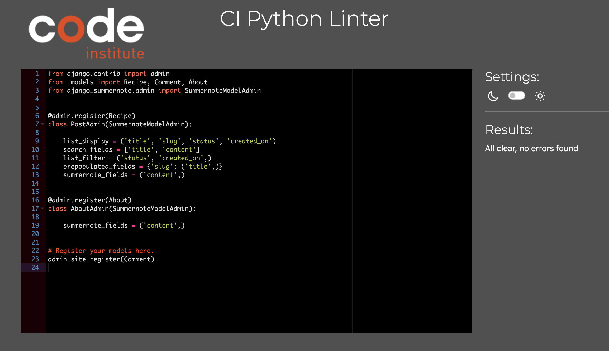
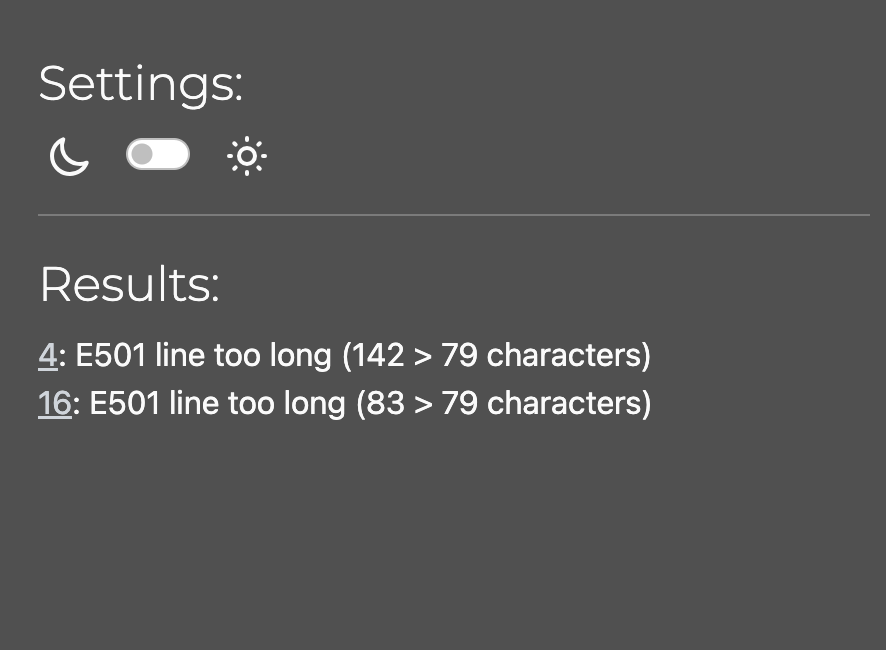
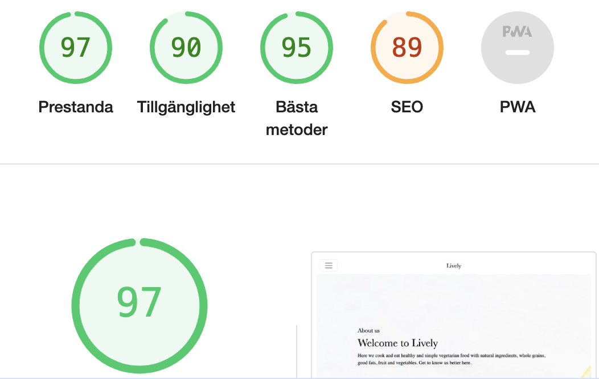
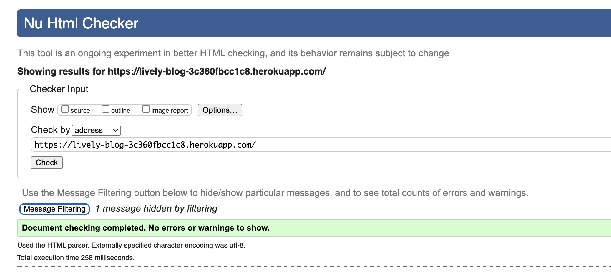
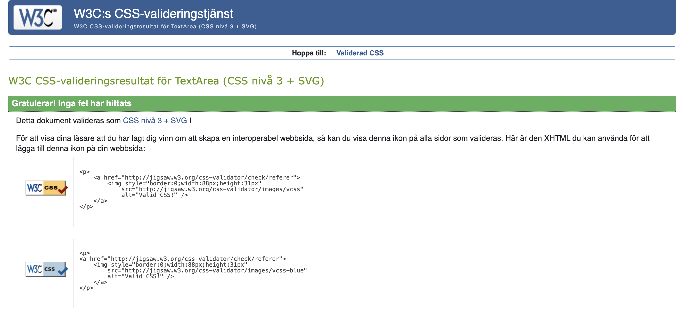
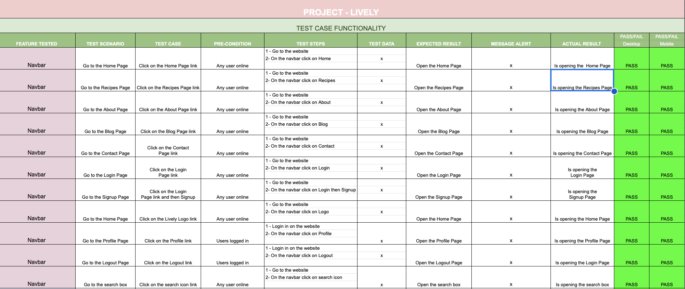
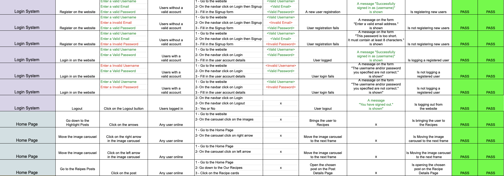
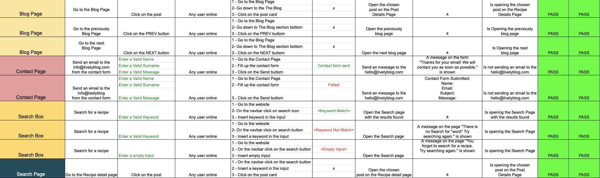
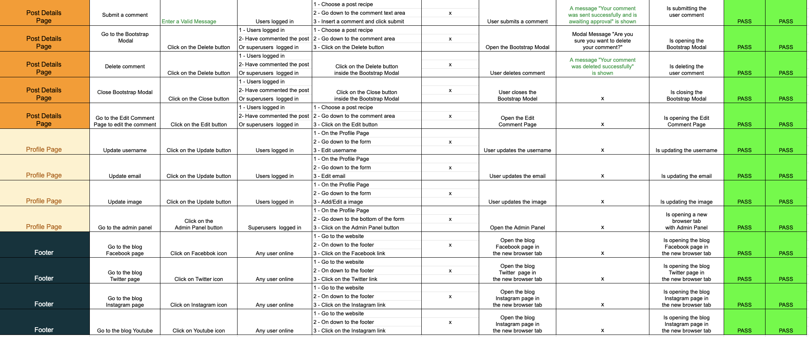

# Lively Blog Testing

Back to the [README](README.md)

The testing.md file provides an overview of the testing conducted on Lively website. 
It covers code validation, accessibility, performance, testing on various devices, browser compatibility, testing user stories, and user feedback and improvements. In each section one can find the tools used, the issues found, and the corresponding test results.
 

### Python Validation - PEP8

* Python testing was done using the PEP8 Online to ensure there were no syntax errors in the project. All python files
were entered into the online checker and no errors were found in any of the custom codes.

One URL was too long, while the other lines that exceeded the recommended length were automatically generated by Django.

### Lighthouse

Lighthouse was used to test Performance, Best Practices, Accessibility and SEO on Desktop.

### HTML Validation

### CSS Validation

## Manual Testing

I tested the whole website features and everything seems to work as it should.
here is the Test case for this project: 

Find test case [here](https://docs.google.com/spreadsheets/d/1D6TdwZwfZ7mVyK9X_Vib12rzuCj9LZSZBPsawDiswSs/edit?usp=sharing)

## Bugs
### Fixed Bugs

* Bug 1: Blank Lines and Whitespace Issues in Views

Error: The views file in the Django application had multiple instances of blank line and whitespace issues, leading to linting errors. These issues violate PEP 8 guidelines, impacting code readability and style.

Fix: The fix involved adding or adjusting blank lines where needed and removing trailing whitespaces. 

* Bug 2: Missing Error Messages for Comment Submission

Error: When users encountered issues submitting comments, the error messages displayed were unclear and didn't provide sufficient information. Users might have been confused about what went wrong, impacting their experience on the website.

Solution: I enhanced the error messages for comment submission. Now, if there's an issue with the comment, users will receive more informative messages, guiding them on how to correct the problem. 

